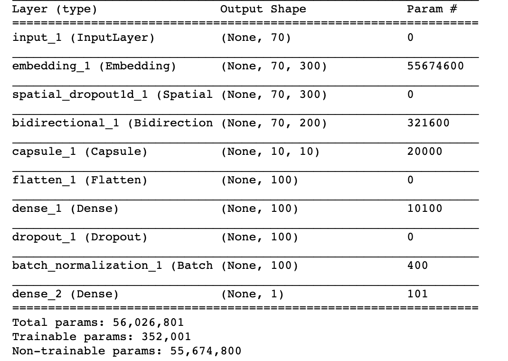

# CS221_Project
The purpose of this repository is to implement Quora insincere sentence classification in NLP with deep learning.
It is part of CS221 project

## Highlights
* Naive Bayes Classifier as baseline
* Bi-directional LSTM with combined embeddings and capsule network for aggregation as the final model
* F1-score of 0.70

## Environment:
Python 3.7.1  
Tensorflow 1.13.1  
Keras 2.2.4  
Pandas, numpy, sklearn, scikitplot, matplotlib  
GPU with atleast 16GB memory   

## Dataset:
The dataset is available at Kaggle at https://https://www.kaggle.com/c/quora-insincere-questions-classification/data  . A subset of this data is available as train.csv file in the input directory  
Following Word embeddings are needed.  
GoogleNews-vectors-negative300 - https://code.google.com/archive/p/word2vec/  
glove.840B.300d - https://nlp.stanford.edu/projects/glove/  
paragram_300_sl999 - https://cogcomp.org/page/resource_view/106  
wiki-news-300d-1M - https://fasttext.cc/docs/en/english-vectors.html  
Elmo - https://tfhub.dev/google/elmo/2   

## Models tried
* Naive Bayes (Baseline)
* Stacked BiLSTM + Embedding without aggregation layer
* Glove Embedding + BiLSTM + MaxPooling + Threshold optimization
* Paradigm Embedding + BiLSTM + MaxPooling + Threshold optimization
* Elmo Embedding + MaxPooling + Threshold Optimization
* Self Embedding + BiLSTM + MaxPooling + Threshold optimization
* Wiki Embedding + BiLSTM + MaxPooling + Threshold optimization
* Glove+Paradigm Embedding + BiLSTM + Capsule Network + Threshold Optimization

## How To Execute
The models were first implemented in notebook and then converted to *.py  
* NB -  python ./quora_baseline.py
* Glove + LSTM - python ./quora_LSTM_glove.py
* Capsule Network - python ./quora_LSTM_capsule.py

## Final Model

